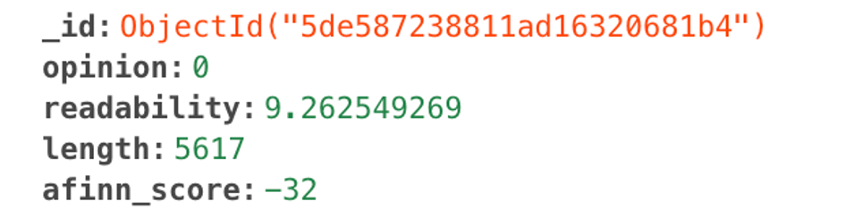

```{r setup, echo=FALSE}
# Tweaks to adjust code chunk font size
chunk_hook <- knitr::knit_hooks$get("chunk")
knitr::knit_hooks$set(chunk = function(x, options) {
  x <- chunk_hook(x, options)
  ifelse(options$size != "normalsize", 
         paste0("\n \\", options$size, "\n\n", x, "\n\n \\normalsize"), x)
})

# Setting default chunk and display options
knitr::opts_chunk$set(
  comment = NA, # remove all hashes from the output
  tidy = FALSE, # display code as typed
  comment = "\t", # tab plain R output
  size = "small", # smaller font for code
  fig.align = "center", # center figures
  eval = FALSE, # do not run chunks
  warning = F, message = F) # suppress warnings & messages in knitted doc
```

\vspace{0.2in}

**A NOTE ON REPRODUCIBILITY:** All of the R code involved in our project is contained within one of our two final products - the [`newspapr`](https://github.com/mcgirjau/newspapr) package, or the [`NewsRec`](https://github.com/mcgirjau/newsrec) Shiny app. As such, our analysis is not reproducible within a `.Rmd` document in the conventional way. Package scripts are too interconnected and involve a large amount of helper functions, and Shiny app snippets are typically lengthy and involve a lot of bulky defensive coding to guard against potential errors. This inevitably means that our technical report can include very few code snippets, but we invite a curious reader to explore the project GitHub repos to view the whole code within its appropriate context.

# Overview

## Motivation

With people in our current age having less and less time to search for things they enjoy, along with the pressure of using every second in our day productively, personalized recommendation systems are becoming more and more important. They can figure out what you like based on your previous activity (**content-based filtering**) and/or based on your similarity to other users (**collaborative filtering**), thus saving you a considerable amount of time and effort. We are familiar with such recommendation systems for music (e.g. Spotify's Release Radar), as well as for videos (e.g. Youtube's suggestions). However, there is a notable lack of personalized recommendation systems in areas outside the entertainment industry, such as the press. Noticing this and desiring to put our data science knowledge to good use, we decided to create our very own scalable news recommendation system (by its development name, *NewsRec*). This way, you don't have to sift through mounds of news every morning to find something of interest - the system can just issue you with articles that you're likely to enjoy, thus allowing you to reap the benefits of machine learning algorithms in your everyday life.

## User Flow

Our app asks users to indicate their preferences over a training set of articles, preferences which then get stored in a remote database. The app can provide news and blog article recommendations from a large variety of sources, and in a variety of languages, all based on a logistic regression model used for determining the probability that the user will like a specific article.

**1. Log In / Sign Up:** Running the app directs the user to signup/login page, where existing users can login with their respective credentials (specifically, username and password), while new users can sign up for an account by entering their desired username and password, as well as two API keys for the system to use. Both API keys can be obtained for free from their respective websites: [NewsAPI](https://newsapi.org/register) and [Diffbot](https://www.diffbot.com/plans/trial). 

**2. Train the System:** While the app is able to recommend articles regardless of previous training, that defeats the point of a personalized recommendation system. It is then optimal for the user to train the system before attempting to generate articles tailored to their taste. The app generates a training set based on some user-specified keyword, which the user can then proceed to rate as liked or disliked. We recommend that multiple keywords be used in the process, so that a larger variety of articles gets sampled. The system saves all user preferences in a cloud database in order to be able to access them later, when it is time for recommendations to be issued. We suggest that users indicate their preferences for at least 10-20 articles, so that the system has sufficient data to make informed recommendations.

**3. Explore Recommended News:** Finally, the user can explore their personalized recommendations in the "Explore" tab. Here, one can search for either the current top headlines, or for all up-to-date articles. After specifiying some information like a preferred keyword, country, category, or language that the user would like to search articles by, the system will issue a personalized article recommendation. The recommended article will appear along with the headline (which contains a hyperlink to the article's original page), a short description, the author's name, and the source. The computed probability of the user liking the article is also displayed as a potential fact of interest for those users wondering what goes on underneath the hood. 

\newpage

# Data

## API Source

While there are a bounty of available APIs for pulling in news from live online sources, most such APIs are focused around a specific publication (e.g. The Guardian or The New York Times). A more flexible approach was desired, so that the user doesn't have to be limited in their choice. As such, the most appropriate API for our goal turned out to be [NewsAPI](https://newsapi.org/), which provides breaking news headlines and articles from over 30,000 worldwide news sources and blogs.

The API is free to use (with some limitations), and requires the user to register in order to receive a key. Limitations of the free plan include a 15-minute delay for the availability of new articles, a maximum of 500 requests per day, and access to articles at most a month old. Given that our users are not expected to make an excessive number of daily calls, and will probably be most interested in accessing current news, these limitations do not pose any inconvenience for our end goal.

## API Wrapper Package

In order to ease working with NewsAPI from within R, we have written `newspapr` - a wrapper package that extends the full functionality of the API as functions within R. Each NewsAPI endpoint is supported through its own function, with arguments corresponding to all the the available query parameters for the GET requests: for the `top-headlines` endpoint, there's the `get_top_headlines()` function, for the `everything` endpoint, there's `get_everything()`, and for the smaller `sources` endpoint, there's `get_sources()`. The philosophy of `newspapr` was focused around highly defensive coding in order to minimize the possibility of HTTP request errors due to improper usage. As such, the main three functions check for the validity of all parameters before passing them to the API in a GET request, and issue an error should one of the arguments be invalid.

All functions return tibbles with 20 rows (since the API defaults to a page size of 20, but this can be extended up to 100). For the functions focused on news articles (i.e. `get_top_headlines()` and `get_everything()`), each row corresponds to an individual article, and the columns hold information like author, source, publication date, URL, description etc.

Currently, `newspapr` is available [on GitHub](https://github.com/mcgirjau/newspapr). For more details on how to install `newspapr`, please read the instructions in [README.md](https://github.com/mcgirjau/newspapr#newspapr-). For how to use the functions within the package, please consult the [package documentation](https://github.com/mcgirjau/newspapr/blob/master/newspapr-manual.pdf) or get help on specific functions by running e.g. `?get_everything` in your console. Finally, to see the actual R code involved in building the package, feel free to explore the scripts within the [`R/` directory](https://github.com/mcgirjau/newspapr/tree/master/R) on GitHub.

## Content Extraction

Having pulled in a variety of articles along with their URLs through NewsAPI and `newspapr`, the system then needs to access the article's actual text content, since that is what the user would be reading. With the large amount of information available on modern web pages, extracting elements of interest from the HTML source is a rather challenging task. In our case, this challenge is amplified by the fact that each news outlet employs a different page structure, so writing a web scraping function versatile enough to pull in exclusively the article text from over 30,000 websites is a daunting task. [Diffbot](https://www.diffbot.com/products/automatic/article/) is an AI web extraction API that offers exactly the solution for our problem - its article extraction functionality views content just as a human user would, and strips it of unnecessary HTML tags, scripts, or styles.

Below is a code snippet from the Shiny app's `global.R` script that illustrates the way Diffbot was used for pulling in an article's content.

```{r}
# Function to get article text content using Diffbot API (REQUIRES KEY)
.get_text <- function(article_url) {
  DIFFBOT_KEY <- Sys.getenv("DIFFBOT_API_KEY")
  query_url <- paste0("http://api.diffbot.com/v2/article?token=", DIFFBOT_KEY, 
                      "&url=", article_url)
  text <- query_url %>%
    RCurl::getURL() %>%
    RJSONIO::fromJSON() %>%
    as.list() %>%
    .$text
  if (!is.null(text) && text == "") {
    text <- NULL
  }
  return(text)
}
```

## Content Metrics

A variety of metrics were calculated on the actual content of the article. This included the **length of the article** (in characters), the **AFINN sentiment score** (calculated using the `tidytext` package) which tells us how positive or negative an article is, and the **Flesch-Kincaid readability score** (calculated using the `readability` package) which tells us how easy an article is to read, in terms of the education level required to fully understand it.

Each of these metrics are calculated by a different function. For instance, the code for calculating the AFINN score of an article is displayed below.

```{r}
# Function to get sentiments (based on AFINN lexicon) of article
.get_sentiment <- function(text) {
  # Clean up text and remove stop words
  text_tbl <- tibble(article = text) %>%
    tidytext::unnest_tokens(word, article) %>%
    dplyr::anti_join(stop_words)
  num_words <- nrow(text_tbl)
  afinn_score <- text_tbl %>%
    inner_join(tidytext::get_sentiments("afinn")) %>%
    summarize(afinn_score = sum(value)) %>%
    .$afinn_score
  return(afinn_score)
}
```

All of these metrics will be used as descriptive characteristics in order to identify similarities between articles that the user likes and articles that the user doesn't like, so that the system can form a more accurate idea of their preferences.

## Data Storage and Access

For the system to be effective, both individual users and their specific preferences need to be somehow stored for later access. We found the perfect solution for this to be a cloud MongoDB cluster. MongoDB is the most popular **NoSQL** ("**N**ot **o**nly **SQL**") database framework, which differs from traditional SQL management systems in that it aims for an increased flexibility for data storage and attempts to eliminate the rigid conventions of rectangular tables in relational databases. Specifically, a MongoDB **cluster** consists of several **databases**, and each database is broken down into multiple **collections**. Within the collections is where the individual data points (called **documents**) are being stored, in a **key-value format**. The screenshot below illustrates the form of such a document.



Within the app's cluster, the credentials (i.e. username, password, and API keys) are held as separate documents for each user in the `users` collection from the `users` database. The individual user preferences are stored as a document for each article in a collection named after a specific user, all within a `preferences` database. Specifically, we store the computed metrics for each rated article, as well as the user's verdict (a 1 if the user liked the article, and a 0 if not).

In order to access this remote MongoDB cluster from within R, the `mongolite` package was used, which offers functions for pulling data from specific databases and collections in the form of analysis-ready data frames, as well as functions for easily inserting new observations. Below is an illustration of a code snippet which checks whether a user's credentials exist within the database.

```{r}
# Function to check for valid user in MongoDB database
.verify <- function(u, p) {
  con <- mongolite::mongo(collection = "users", db = "users", url = .url)
  users <- con$find()
  if (u %in% users$username) {
    current_user <- users %>%
      filter(username == u)
    if (current_user$password == p) {
      return(TRUE)
    }
  }
  return(FALSE)
}
```

\newpage

# Implementation

## Shiny

For our news recommendation system, a flexible implementation was desirable, but also one from within which statistical modeling and data wrangling could be easily performed. As such, we chose the intersection of the R programming language and the highly-customizable field of web development, namely the Shiny framework. More specifically, the app took the form of a Shiny Dashboard, which eases navigation between different parts of the user flow while also keeping them appropriately separate.

Almost all pages in our app are dynamic UIs. A first use for that is the login page - we needed a way to authenticate different users so that their preferences don't get jumbled up and our recommendation system remains truly *personalized*. As such, reactive values were used in order to decide whether the user is logged in or not. If not, the login page remains the only thing displayed by the app, but once the user logs in or signs up, the full funcitonality of the app is revealed instead. 

In turn, the various pages within the full app are also composed of dynamic UIs. The training page and the article recommendation page display a whimsical GIF of a pig reading the news in a rocking chair until appropriate inputs for article search are selected. The controls for article search are also dynamic, due to the fact that NewsAPI accepts different query parameters for its `top-headlines` and `everything` endpoints.

## Shiny Enhancements

A lot of packages extend the functionality of Shiny, and we decided to explore the landscape of Shiny enhancements in order to depart from repetitive Shiny design patterns and add some professionalism and uniqueness to our app. For instance, the package `shinyjs` was used in order to add some extra interactivity to our app, such as toggleable error messages that appear when the user has entered some invalid input. In addition, the package `shinycssloaders` was employed in order to add loading graphics to dynamic UIs. These graphics let the user know that the app is working behind the scenes, and make it appear overall less buggy.

## Processing Speeds

Processing speed is not one of the strengths of R, and much less of Shiny - they are both notoriously slow, especially when it comes to complex computations. As such, our app does tend to lag as it is performing its analyses. We find this to be a suboptimal user experience, so steps were taken in order to make the wait more palatable for users. Since Shiny does not display any indication that it is currently doing heavy-lifting behind the scenes, a first step was to add in a loading graphic for some dynamic UIs in order to make it explicit that UI is loading (as mentioned in the previous section). Otherwise, the app appears buggy and it can be misleading to the user - how would one know if some error occurred, or if everything is fine?

Another technology that we thought could be efficiently leveraged is parallel programming - basically the idea that when program execution encounters a computationally-heavy process, the program then branches out into two - a branch for said process to run in, and a branch for the current flow to continue without being affected by the loading times of other expensive processes. The two branches are said to run in parallel, and the way this is achieved is by dividing the work between a computer's various cores. In this way, the app's interface can always be reactive and fully responsive, while all the processing that would otherwise lag the interface now just runs in the background and returns its results for the main interface to handle whenever it's ready.

R already has packages meant for parallel programming, such as `future` (for creating forked processes), `promises` (for reincorporating the results of such forked processes back into the main flow of the program), and `future.apply` (which provides a parallel framework for the familiar `apply` family of functions). All that is needed, then, is an understanding of how to identify the computationally-heavy code chunks, how to isolate them into forked processes (called "futures") without causing errors in the main execution flow, and finally how to incorporate the values yielded by a future (called "promises") back in. This is an extensive field, and lengthy vignettes have been written, so a full explanation of the details will not be provided.

The slower parts of our code were mainly the calls to the Diffbot API, which takes some time for article extraction. Calls to Diffbot are made everytime a user rates an article on the training page, so one would have to wait around 5-10 seconds for the article cleaning, metric calculation, and submission to database to happen. This is clearly suboptimal - training the system would be 90\% waiting and only 10\% actual article rating. As such, all calls to the `.get_text()` function illustrated above had to be placed in a future. Below is a snippet of code illustrating how the app manages to continuously display article after article in a snappy manner, with each rating being created as a separate forked process in the background, without affecting the main execution of the app.

```{r}
  # When the user rates an article, submit article info to database
  observeEvent(input$rate, {
    current_url <- current_article()$url
    liked <- ifelse(input$like == "Yes", 1, 0)
    # Creating a future
    future({
      .get_text(current_url)
    }) %...>% .submit(liked)
    counter$i <- counter$i + 1
  })
```

## Customization

Since Shiny is effectively a web framework, it is easy to customize using CSS (for adding extra style) and JavaScript (for adding extra interactivity). CSS was mainly used for centering components, setting widths and shadows, as well as adding color to error messages. JavaScript was employed in creating the Log Out button (which basically reloads the session), and for associating the main buttons of the app with the `Enter` key (by default, Shiny buttons need to be clicked, whereas conventional user flow is simply hitting `Enter` once done). A final use for JavaScript within our app was to change the Shiny Dashboard sidebar so that it automatically collapses upon tab change. By default, the sidebar remains open at all times, which takes up valuable space on the user interface, so having it collapse automatically was yet another tiny way of improving the overall user experience. Below is a code snippet from `server.R`, illustrating how this last task was achieved.

```{r}
  # Dynamically close sidebar when a tab is clicked
  observeEvent(input$sidebar, {
    # for desktop browsers
    addClass(selector = "body", class = "sidebar-collapse")
    # for mobile browsers
    removeClass(selector = "body", class = "sidebar-open")
  })
```

\newpage

# Recommender System

## Foundations

For our app, we used a content-based recommendation system. Such systems provide users recommendations based on the content of an article and the preference history of the user. The primary reason for employing this particular type of recommendation system is that it is easier to develop for applications that don't yet have many users. Once an application gains a significant user base, collaborative filtering can also be employed in order to determine one user's similarity to other users. Most modern recommendation systems employ a mixture of these two approaches, called hybrid filtering.

A content-based recommendation system needs to be trained prior to usage, since it relies heaviliy on a user's history, and it will then fit some sort of model in order to make predictions about future items.

## Logistic Regression Model

We decided to issue recommendations through a **multiple logistic regression model**, with predictors being the various metrics calculated by the app, such as the Flesch-Kincaid readability score, the article length (in characters), and the AFINN sentiment score. The response variable is the probability of a user liking an article, which ranges from 0 to 1. The data used for fitting the model are the preferences indicated by the user on the system training page - recall that articles are stored with a 1 if the user liked them, and with a 0 if not. The snippet below displays the function used to fit the logistic regression model.

```{r}
# Logistic regression model to predict if user will like article or not
.fit_model <- function() {
  username <- Sys.getenv("USERNAME")
  con <- mongolite::mongo(collection = Sys.getenv("USERNAME"), db = "preferences", url = .url)
  preferences <- con$find()
  model <- glm(opinion ~ ., data = preferences, family = binomial(logit),
               na.action = na.exclude)
  return(model)
}
```
  
## Decision Algorithm

The regression model then uses its fitted equation which predicts the probability that a user will like some article, and applies it to a new set of articles. Some issues with using a logistic regression model for issuing recommendations are (1) the user may not have trained the system yet, and (2) the user may have given really inconsistent ratings. As such, it is not feasible to set a cutoff point for the probability that the user likes some article, and then only recommend the ones above said cutoff. What if no articles manage to reach that cutoff? What if there's no fitted model to generate such a cutoff in the first place?

To deal with such issues, we had to create a specific algorithm that would work in all cases. First of all, if the user hasn't trained the system yet, they just get recommendations based on news popularity (the default returned by NewsAPI). If the user *has* trained the system, then the fitted model gets applied to the new article pool for prediction-making, and the articles are then ranked in decreasing order of the probability that the user will enjoy them. The top article then gets recommended. This way, even if no articles are more than 20% likely to be liked by the user, recommendations will still be issued.

\newpage

# Conclusions

## Putting Everything Together

Recommendation systems are all around us, and they're likely to become an ever larger part of our daily lives. Developing our own recommendation system for news shed some light on the inner workings of such engines, and introduced us to some of the challenges that are encountered in replicating user preferences with an algorithm. While predictors like the AFINN sentiment score and the Flesch-Kincaid readability score are very plausible factors that could influence whether a user likes some article, real life is more complicated than that. Of course, users will tend to dislike articles that are either too complicated or too easy for their education level, and everyone prefers either happy ot sad news, but sometimes it can also be more about the topic of interest, or about how beautiful and eloquent the writing style is. Such aspects are harder to capture within an algorithm, although it's definitely not unfeasible. We have only managed to account for some part of the variability in user preferences, and it is safe to assume that the field of recommendation engines will remain alive and vibrant as long as there are improvements to be made and new ways of thinking to incorporate.

## Future Improvements

In the overview section of this report, we hailed our system as a scalabe solution to the lack of personalized news platforms provided by the market. Our system would need several adjustments before it becomes a fully-functioning website/app, and therefore our future considerations on the macro-level are related to scalability.

First of all, the logistic regression model currently used is far from optimal. Evaluation of the model and its predictors are key components of the creation process, but have been overlooked for the purpose of simplicity. Tests such as the likelihood-ratio test and the Hosmer-Lemeshow Test would improve the predictive power of our model significantly if used to refine the logistic equation.
    
Further, we could have used a completely different classification algorithm for predicting a user's preference towards a certain article. Alternative algorithms include (but are not limited to) naïve bayes, K-nearest neighbours, and Support Vector Machine (SVM) classifiers. To optimize our user experience, we could also create a hybrid system combining content-based and collaborative recommendation systems, once the user base is large enough. A collaborative recommendation system would help us optimize our recommendations by accounting for the informational value that lies within user network characteristics for prediction, rather than solely relying on the content of the article.
    
Finally, we are using free, restricted APIs that only allow for a certain number of calls per day. This is not a significant problem for the development version, but would prove to be an issue if we were to open this app to a wider audience. Integrating full, paid versions of the APIs that allow for unlimited calls would solve this issue.
